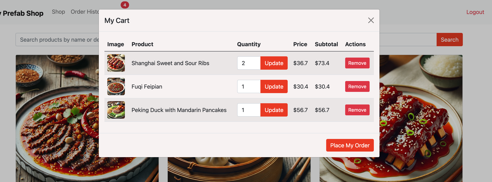
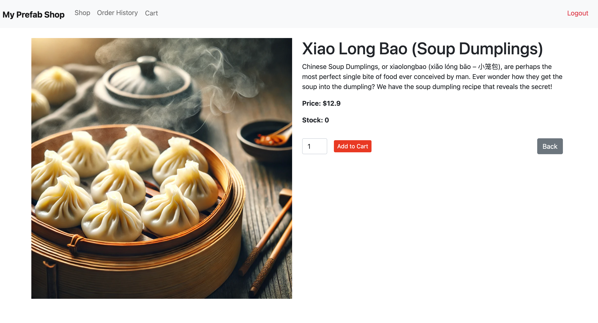
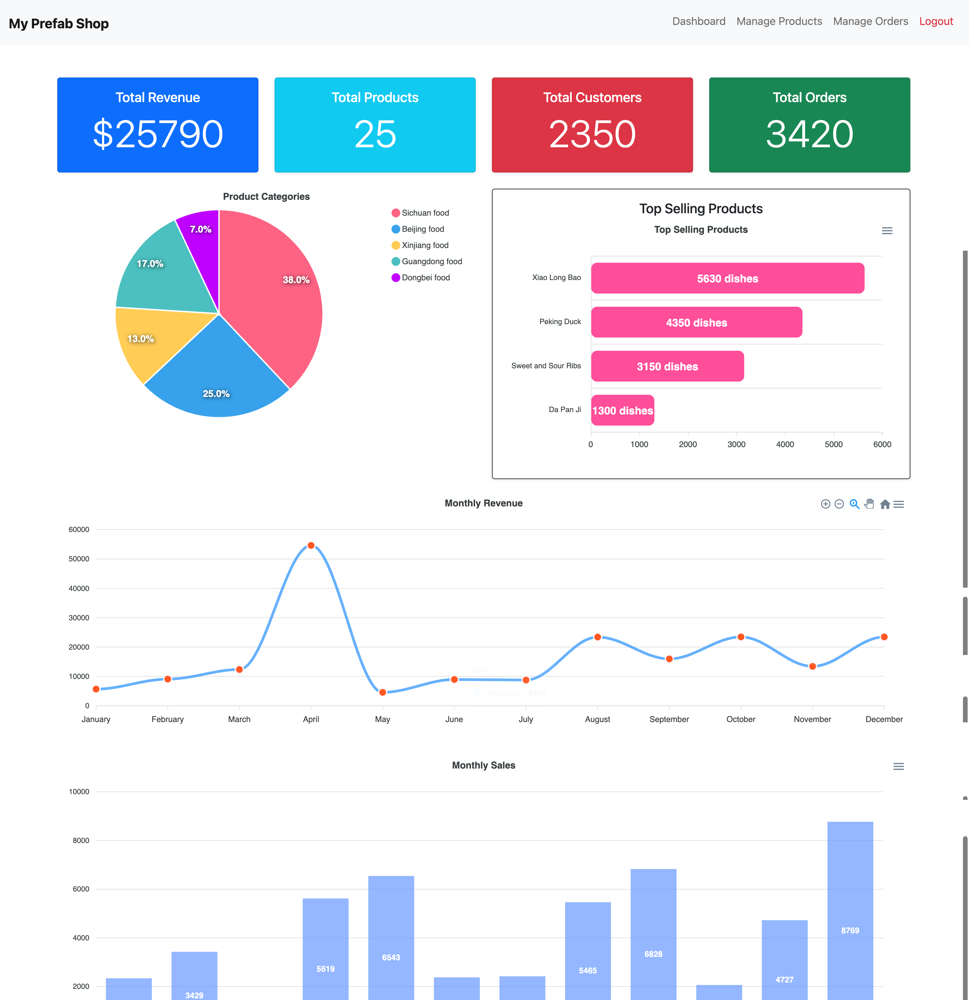
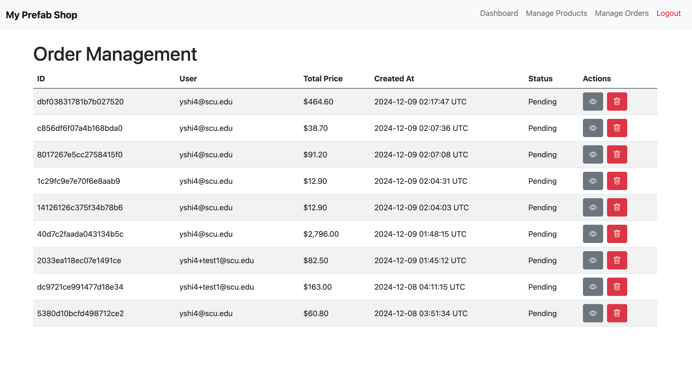

# README

#### This is 278 Web-Programming project, it is an e-commerce platform, using ruby and rails framework, the front-end uses bootstrap and ApexChart, in general this is an e-commerce platform selling prepared dishes, there are two roles of user: customer(including guest and signed-in customer) and administrator,

## Screenshot of main pages
Customer accessible pages:

Admin accessible pages:

