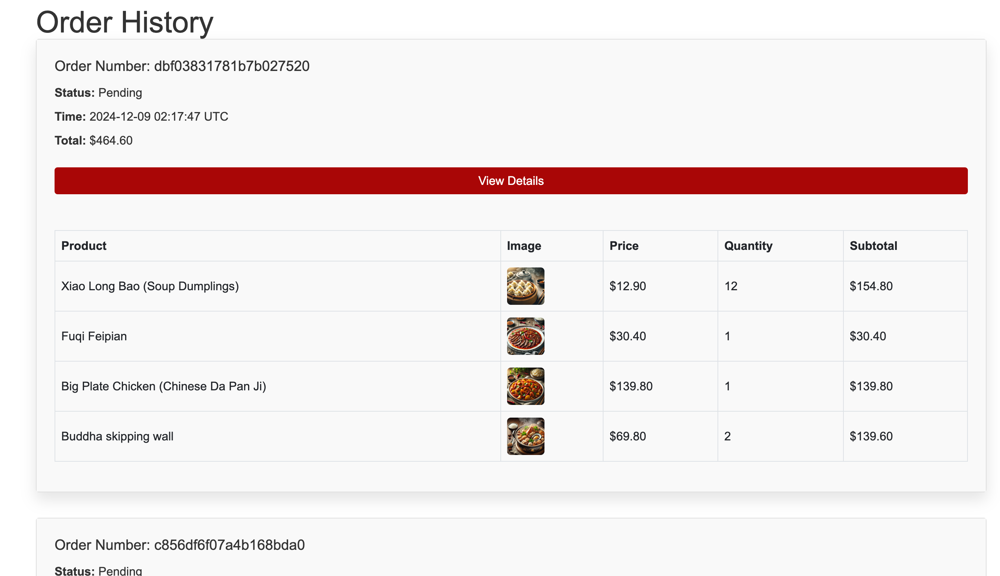

# README

#### This Ruby on Rails project is a dynamic e-commerce platform for prepared dishes, featuring robust functionalities such as a dish search engine for quick and easy browsing. It supports role-based authentication with separate login and sign-up options for customers and administrators, allowing seamless user and product management. The platform combines scalability, responsiveness, and security to deliver a user-friendly and efficient experience for all stakeholders in the prepared dishes marketplace.

To run the application:
```
rails server
```

## Screenshot of main pages
Customer-accessible pages:




Admin-accessible pages:


